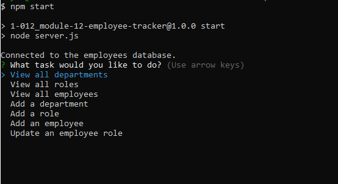
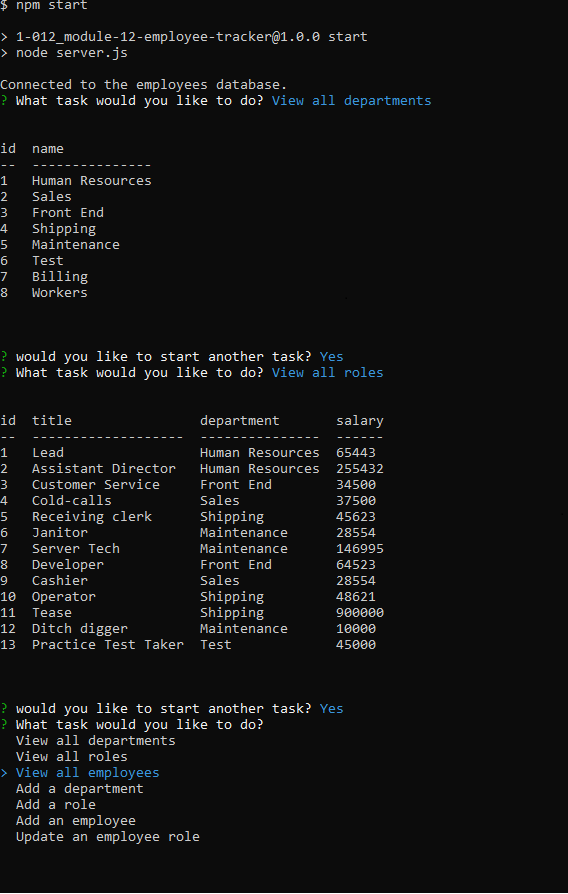
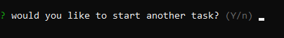

# Employee Tracker 

## Description 

This is a application to create, read, update and delete a database of employees. There is still room for improvement, and additional functionality to be added.
The lowest level of acceptability of view, add anf update has been included, and additional functionality will be added in the future.
 
## Table of Contents
 
- [Installation](#installation)
- [Usage](#usage)
- [Credits](#credits)
- [License](#license)

##  Installation 

Install modules
Create a .env file
inside the .env, make 3 variables :
DB_LOCATION = "employees_db"
DB_NAME = your login
SECRET_KEY = your password

## Usage 

Visit https://app.castify.com/view/33889dfe-2200-41c7-b23f-1d4c4fe0e3ba to watch walkthrough video

## Credits 

n/a 

## License 

MIT License 
Please refer to License in repository.  
 